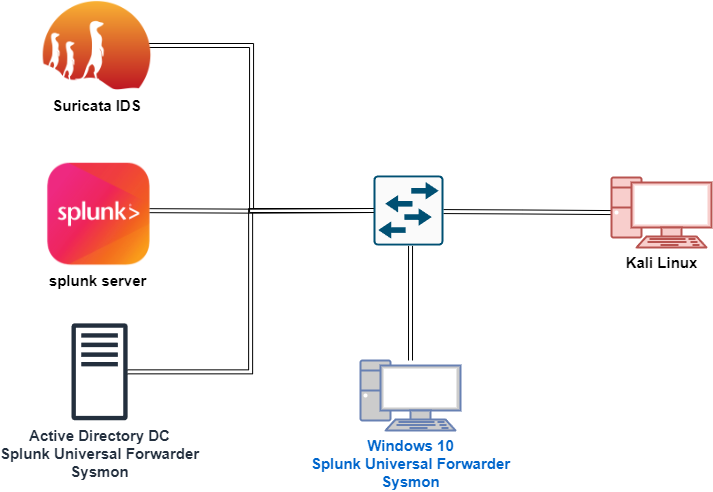

<h1>Active Directory Monitoring and Attack Simulation with Splunk, Suricata IDS, and Kali Linux</h1>

This project demonstrates an integrated monitoring setup using <strong>Splunk</strong>, <strong>Suricata IDS</strong>, and <strong>Sysmon</strong> for security event logging and analysis, coupled with an <strong>Active Directory (AD) environment</strong>. The setup also includes a <strong>Kali Linux</strong> machine to simulate attacks using <strong>Atomic Red Team</strong> techniques for testing detection capabilities.

<h2>Architecture Overview</h2>

  

<h2>Workflow</h2>
<ol>
  <li><strong>Active Directory Domain Controller (DC)</strong>: The AD DC is monitored by Splunk through the <strong>Splunk Universal Forwarder</strong> and <strong>Sysmon</strong> to track detailed system events.
    <ul>
      <li>The Universal Forwarder on the AD DC sends logs related to authentication, group policy changes, and other domain-related events to the Splunk server.</li>
    </ul>
  </li>
  
  <li><strong>Splunk Server</strong>: This server collects and processes logs from all connected systems, including the AD DC, Windows clients, and Suricata IDS. Splunk analyzes events and provides insights through dashboards and reports.
    <ul>
      <li>Suricata IDS events and network traffic alerts are also ingested into Splunk, enhancing network visibility and security detection.</li>
    </ul>
  </li>
  
  <li><strong>Suricata IDS</strong>: Monitors network traffic for malicious activities and intrusion attempts. Suricata detects threats and sends alerts to the Splunk server for correlation and analysis with other data sources.
  </li>
  
  <li><strong>Windows 10 Client</strong>: This machine is part of the domain and is monitored by Sysmon and the Splunk Universal Forwarder to track endpoint activities such as process creation, network connections, and file modifications.
  </li>
  
  <li><strong>Kali Linux Machine</strong>: Acts as the attacker’s machine for simulating attacks using <strong>Atomic Red Team</strong>.
    <ul>
      <li>Simulated attacks test the detection capabilities of the Suricata IDS and Splunk’s correlation of Sysmon data from the Windows 10 client and AD DC.</li>
    </ul>
  </li>
  
  <li><strong>Atomic Red Team</strong>: A testing framework that simulates real-world attack techniques. These attack simulations are used to validate the detection and monitoring setup across Suricata IDS, Splunk, and Sysmon on the Windows and AD systems.
  </li>
</ol>

<h2>Components</h2>
<ul>
  <li><strong>Active Directory DC</strong> - Monitored via Splunk Universal Forwarder and Sysmon for domain-specific events.</li>
  <li><strong>Splunk Server</strong> - Central log collector for processing and analyzing events from all systems.</li>
  <li><strong>Suricata IDS</strong> - Network intrusion detection system that sends alerts to Splunk.</li>
  <li><strong>Windows 10 Client</strong> - Endpoint monitored by Sysmon and Splunk Universal Forwarder.</li>
  <li><strong>Kali Linux</strong> - Used to simulate attacks with Atomic Red Team.</li>
  <li><strong>Atomic Red Team</strong> - Attack simulation framework used to test the security setup.</li>
</ul>

<h2>Automation Features</h2>
<ul>
  <li>Real-time monitoring of Active Directory events using Splunk and Sysmon.</li>
  <li>Network intrusion detection with Suricata IDS, feeding alerts into Splunk for correlation with endpoint and AD data.</li>
  <li>Automated attack simulation using Atomic Red Team to test the detection capabilities of the security stack.</li>
</ul>

